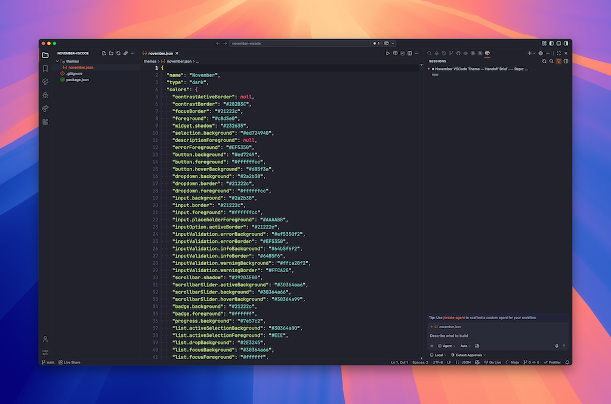

# November

> A dark VS Code theme with warm amber accents — calm, focused, and easy on the eyes.




---

## Palette

| Role       | Colour                                                                       | Hex       |
| ---------- | ---------------------------------------------------------------------------- | --------- |
| Background |  | `#21222c` |
| Selection  |  | `#30364a` |
| Borders    |  | `#272a38` |
| Accent     |  | `#ed7249` |
| Foreground |  | `#c8d5e0` |
| Muted      |  | `#b8c5d0` |

---

## Installation

**Via Marketplace**

1. Open VS Code
2. `Cmd+Shift+X` → search **November**
3. Install → `Cmd+Shift+P` → **Preferences: Color Theme** → **November**

**Via CLI**

```sh
code --install-extension kud.november-vscode
```

---

## Recommended Settings

```json
{
  "workbench.colorTheme": "November",
  "editor.fontFamily": "'JetBrains Mono', monospace",
  "editor.fontLigatures": true,
  "editor.cursorBlinking": "smooth"
}
```

---

## Development

```sh
# Install tooling
npm install

# Preview — symlink the repo into your VS Code extensions folder, then reload the window
ln -s "$(pwd)" ~/.vscode/extensions/november-vscode

# Package a .vsix for local testing
npm run package

# Check what will be bundled
npm run ls
```

### Publishing

```sh
# Bump version, commit, tag, and push
npm run release:patch   # 0.1.0 → 0.1.1
npm run release:minor   # 0.1.0 → 0.2.0
npm run release:major   # 0.1.0 → 1.0.0

# Package and open the marketplace upload page
npm run marketplace
```

---

## License

MIT © [kud](https://github.com/kud)
